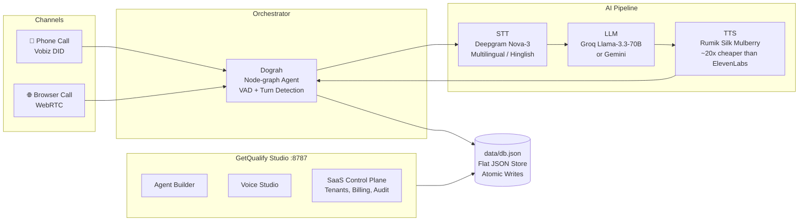

<div align="center">


# GetQualify Voice Agent Stack

**Production AI phone agents at ~₹2/min — self-hosted, provider-agnostic, zero vendor lock-in.**

[](https://github.com/Lordporus/GetQualify-voice-agent/actions/workflows/dashboard-ci.yml)
[](https://nodejs.org)
[](LICENSE)
[](https://deepgram.com)
[](https://groq.com)
[](https://rumik.ai)

[**Quickstart**](#quickstart) · [**Architecture**](#architecture) · [**Dashboard**](#dashboard--saas-control-plane) · [**Docs**](docs/) · [**Pricing**](docs/PRICING.md)

</div>

---

## Why This Stack?

Most teams building AI voice agents end up on ElevenLabs + Twilio + GPT-4. That is expensive, opinionated, and every key goes through three separate vendors. This stack is the opposite.

| | GetQualify Stack | Typical ElevenLabs + Twilio + GPT |
|---|---|---|
| **Cost per minute** | ~₹1.6–2.6 | ~₹15–20 |
| **Gross margin (agency)** | 78–86% | ~30–40% |
| **Vendor lock-in** | None — swap any layer via `.env` | Locked to 3 SaaS contracts |
| **Data sovereignty** | All keys and data on your own VPS | Keys traverse 3rd-party clouds |
| **Deployment** | 6 scripted steps, bare Ubuntu to live call | Multi-platform, multi-account setup |
| **Dependencies** | 1 runtime (`ws`) + pure Node stdlib | NPM chains, build pipelines |
| **Multi-tenant SaaS** | Built-in (tenants, roles, billing, audit) | Build it yourself |

The gap is almost entirely the voice layer: Rumik Mulberry costs ~500 INR/1M chars on promo vs ~10,000 INR for ElevenLabs. Roughly 20x cheaper.

---

## Feature Highlights

| | |
|---|---|
| 📞 **Real Phone Calls** — Answers inbound, places outbound, interruption-aware mid-sentence barge-in | 🧠 **Provider-Agnostic AI** — Swap STT, LLM, and TTS via env vars. No code changes. |
| 🏢 **Full Multi-Tenant SaaS** — Isolated tenants, scoped roles, wallets, PayU billing, audit logs | 🎙️ **Live Voice Studio** — Synthesize speech, stream audio, compare speakers and pitch in the browser |
| 🔒 **Zero-Trust Security** — Keys never reach the browser. scrypt auth, httpOnly cookies, HTTPS-only | ⚡ **One-Shot Deploy** — Bare Ubuntu VPS to a ringing phone in 6 scripted steps |

---

## Architecture



Every layer is swappable. Dograh natively supports Twilio, Telnyx, Plivo, Vonage, and Cloudonix for telephony. The AI pipeline accepts any STT, LLM, or TTS provider that implements the uniform adapter contract in `lib/providers.js`.

---

## The Stack

| Layer | Component | Alternative Providers |
|---|---|---|
| **Orchestrator** | [Dograh](https://github.com/dograh-hq/dograh) (open source) | — |
| **Telephony** | Vobiz (Indian numbers, Plivo-compatible) | Twilio, Telnyx, Plivo, Vonage, Cloudonix |
| **Speech to Text** | Deepgram `nova-3-general` | — |
| **Brain** | Groq `llama-3.3-70b-versatile` | Gemini (wired, set `LLM_PROVIDER=gemini`) |
| **Voice** | Rumik Silk `mulberry` | ElevenLabs, Sarvam (adapter contracts in `lib/providers.js`) |
| **Dashboard** | GetQualify Studio (zero-dependency Node) | — |

---

## Repository Layout

```
getqualify-voice-agent/
│
├── .github/workflows/
│   └── dashboard-ci.yml        # CI: build + 23 integration tests on every push
│
├── deploy/                     # Six-step scripted deployment
│   ├── 01-deploy-dograh.sh     # Bare VPS to Dograh with HTTPS (swap, firewall, Let's Encrypt)
│   ├── 02-build-rumik-overlay.sh  # Add Rumik as a native TTS provider
│   ├── 03-configure.sh         # Telephony + DID + model pipeline + workflow
│   ├── 04-check-interrupts.sh  # Verify and fix barge-in, republish
│   ├── 05-place-call.sh        # Place a real outbound call, read back the run log
│   ├── 06-deploy-dashboard.sh  # Deploy GetQualify Studio on :8787
│   └── rumik-overlay/          # Docker overlay image for the Rumik TTS provider
│
├── dashboard/                  # GetQualify Studio — full SaaS control plane
│   ├── server.js               # Zero-dependency HTTP server (Node stdlib only)
│   ├── lib/
│   │   ├── core.js             # DB (atomic JSON), auth (scrypt), session management
│   │   ├── providers.js        # Provider-agnostic STT / LLM / TTS adapter registry
│   │   ├── payu.js             # PayU India hosted checkout integration
│   │   └── demo-links.js       # Shareable public demo link system
│   ├── public/                 # Vanilla HTML/CSS/JS frontend (no build step needed)
│   │   ├── index.html          # Marketing landing page
│   │   ├── app.html            # SPA dashboard shell
│   │   └── assets/             # brand.css tokens, app.js, charts.js, voice assets
│   ├── src/charts.jsx          # React + Recharts (compiled to public/assets/charts.js)
│   └── test/                   # 23 integration tests (Node built-in test runner)
│
├── workflows/
│   └── ria-receptionist.json   # 4-node Dograh agent graph, importable as-is
│
├── prompts/
│   └── ria-system-prompts.md   # Full untruncated prompt stack + design rationale
│
├── docs/
│   ├── PRICING.md              # Measured per-minute cost breakdown and margin model
│   ├── RUMIK-OVERLAY.md        # How to add Rumik, and the --no-deps trap
│   └── TROUBLESHOOTING.md      # Every real failure hit on this stack, with real fixes
│
├── .env.example                # All required values with inline notes
└── ONE-SHOT-PROMPT.md          # Paste into any AI coding agent to run the full setup
```

---

## Quickstart

Choose the path that fits your workflow.

### Path A — Full Stack Deploy (Bare VPS to Live Phone Call)

```bash
git clone https://github.com/Lordporus/GetQualify-voice-agent.git
cd GetQualify-voice-agent
cp .env.example .env        # fill in 8 values (see Prerequisites below)
bash deploy/01-deploy-dograh.sh
bash deploy/02-build-rumik-overlay.sh
bash deploy/03-configure.sh
bash deploy/04-check-interrupts.sh
bash deploy/05-place-call.sh
bash deploy/06-deploy-dashboard.sh
```

A fresh Ubuntu 24.04 VPS is live with a real phone number and a management dashboard by the end of step 6.

### Path B — Paste-to-AI Agent (One-Shot)

Open `ONE-SHOT-PROMPT.md` and paste the entire contents into Claude, GPT-4, or Gemini. The agent reads the repository, runs all six deploy scripts, and handles every config step end-to-end.

```bash
cat ONE-SHOT-PROMPT.md   # then paste into your AI agent of choice
```

### Path C — Dashboard Only (Local Dev)

```bash
cd dashboard
npm install
npm start
# open http://localhost:8787
# Default login: hello@getqualify.in / GetQualifyvoice
```

No build step required. The server auto-creates `data/db.json` with a seeded demo tenant on first boot.

---

## Prerequisites

### Infrastructure

- Ubuntu 24.04 VPS, 4 GB RAM recommended (2 GB works — the deploy script adds swap)
- Ports open: `22`, `80`, `443`, plus `3478`, `5349`, and UDP `49152–49200` for browser WebRTC calls
- HTTPS is provisioned automatically via sslip.io — no DNS setup required

### API Keys

| Variable | Provider | Required | Notes |
|---|---|---|---|
| `RUMIK_API_KEY` | [Rumik](https://rumik.ai) | Yes | TTS voice engine |
| `DEEPGRAM_API_KEY` | [Deepgram](https://console.deepgram.com) | Yes | Live transcription |
| `GROQ_API_KEY` | [Groq](https://console.groq.com) | Yes | LLM brain |
| `DOGRAH_API_KEY` | Dograh | Yes | Telephony orchestrator |
| `DOGRAH_EMBED_TOKEN` | Dograh | Yes | Browser call embedding |
| `PAYU_KEY` / `PAYU_SALT` | PayU India | Optional | In-app billing checkout |
| `GETQUALIFY_PUBLIC_URL` | Your domain | Optional | PayU callback URL |
| `GEMINI_API_KEY` | Google AI | Optional | Alternative LLM |
| `CALCOM_API_KEY` | Cal.com | Optional | HVAC desk booking |

Copy `.env.example` to `.env` and fill in the required values. The `.env` file is gitignored — your keys never leave your server.

---

## Dashboard & SaaS Control Plane

GetQualify Studio (`dashboard/`) is a fully-featured multi-tenant SaaS platform. It runs with `node server.js`, using only Node's built-in `http`, `crypto`, and `fs` modules plus one pinned runtime dependency (`ws`).

| Section | What it does |
|---|---|
| **Overview** | Live provider health, usage sparkline, credit balance, quick actions |
| **Agent Builder** | Create and manage voice agents: persona, voice model, speaker, pitch, assigned DID |
| **Voice Studio** | Synthesize speech, stream audio via WebSocket, compare speakers, see chars and INR cost |
| **Talk to It** | Live browser loop: mic to STT to LLM to TTS playback, using your agent's persona |
| **Telephony Console** | DID management, outbound dial (guarded with explicit confirm), inbound routing status |
| **Billing** | PayU India hosted checkout, credit wallet, full audit trail of every transaction |
| **Admin Panel** | Tenant creation, user management, support tickets, complete audit event log |
| **Settings** | Provider registry: see which STT/LLM/TTS/telephony providers are live vs ready-to-wire |

**Tenancy model:** Every agent, usage record, billing event, and API call is scoped to the authenticated tenant. Cross-tenant access returns `403`. Sessions use `scrypt`-hashed passwords stored as `scrypt$<salt>$<hash>` and `httpOnly` cookies.

---

## Cost & Economics

Measured on the reference deployment, mid-2026, at ~85 INR to 1 USD. Assumes the agent speaks for half of each minute, typical for a receptionist with 1-2 sentence turns.

| Layer | Provider | Rate | Per minute |
|---|---|---|---|
| Telephony | Vobiz | ~0.70 INR/min | 0.70 INR |
| Speech to Text | Deepgram Nova-3 | $0.0077/min | ~0.50 INR |
| Brain | Groq Llama-3.3-70B | Per token | ~0.12 INR |
| Voice | Rumik Mulberry (promo) | 0.50 INR/1k chars | ~0.25 INR |
| **Total (promo)** | | | **~₹1.6/min** |
| Voice | Rumik Mulberry (permanent) | 2.50 INR/1k chars | ~1.25 INR |
| **Total (permanent)** | | | **~₹2.6/min** |

Fixed costs: ₹500/month per Vobiz number, $6-12/month for the VPS. Full breakdown in [`docs/PRICING.md`](docs/PRICING.md).

**Agency margin model** — at 3,500 min/month against a ₹40,000/month retainer:

| | Promo | Permanent |
|---|---|---|
| COGS | ~₹5,600 | ~₹9,100 |
| **Gross margin** | **86%** | **78%** |

> **Note:** "AI voice agents from ₹1/minute" is defensible for the AI layer alone (STT + LLM + TTS is ~₹0.90/min on promo). Do not claim ₹1/min all-in. With carrier minutes it is ₹1.6-2.6/min.

---

## CI / Testing

This codebase ships with 23 integration tests covering the full API lifecycle — auth, multi-tenant isolation, billing, PayU checkout, provider registry, and cryptographic session handling. The suite uses Node's built-in `node:test` runner with zero extra dependencies.

```bash
cd dashboard
npm test        # runs all 23 integration tests
npm run build   # compiles src/charts.jsx to public/assets/charts.js
```

GitHub Actions runs build + test on every push and pull request to `dashboard/**`:

```
.github/workflows/dashboard-ci.yml
  pnpm install --frozen-lockfile
  pnpm build
  pnpm test
```

---

## Gotchas & Fixes

Four real failures that cost debugging time on this stack. All four are handled by the deploy scripts. Full details in [`docs/TROUBLESHOOTING.md`](docs/TROUBLESHOOTING.md).

| Symptom | Root Cause | Fix |
|---|---|---|
| Call connects, then sits silent | Number bound to a stale Vobiz app pointing at a dead `answer_url` | Let Dograh create its own application. Place calls through Dograh, never the raw Vobiz endpoint. |
| Agent greets but ignores all input | Realtime native-audio models do not do turn detection over an 8k telephony stream | Use a pipeline model (Groq/Gemini), not a realtime brain. |
| Agent cannot be interrupted | `allow_interrupt` defaults to `false` on a fresh workflow draft. It is a per-node setting. | Enable it per-node in the Dograh workflow editor. No pipeline tuning fixes a disabled flag. |
| Dograh API container breaks after adding Rumik | `pip install pipecat-rumik` without `--no-deps` pulls upstream pipecat over Dograh's vendored fork | Always install with `--no-deps`. Script `02-build-rumik-overlay.sh` handles this automatically. |

---

## Security

| What we protect | How | Where to verify |
|---|---|---|
| Provider API keys | `.env` only, server-side. Keys never serialized into any API response. | `lib/providers.js` — all adapters read `process.env` directly |
| Passwords | `crypto.scryptSync` with random salt, stored as `scrypt$<salt>$<hash>`. Never plaintext. | `lib/core.js:hashPassword` |
| Sessions | Opaque 32-byte random token in `httpOnly` cookie `rxv_sess`, 7-day expiry | `lib/core.js:genSessionToken` |
| Tenant isolation | Every read and write scoped by `ctx.tenant.id` from the verified session | `dashboard/server.js` — all authed routes |
| Outbound calls | Guarded behind explicit `confirm: true` body field and UI confirm modal | `POST /api/telephony/dial` |
| `.env` file | Gitignored at the root | Root `.gitignore` |

Rotate any key that has ever been pasted into a chat, a screenshot, or a log file.

---

## Contributing

Pull requests are welcome. For significant changes, open an issue first to discuss the approach.

1. Fork the repository
2. Create a feature branch: `git checkout -b feature/my-feature`
3. Run the test suite: `cd dashboard && npm test`
4. Submit a pull request

All new AI providers must implement the uniform adapter contract in [`dashboard/lib/providers.js`](dashboard/lib/providers.js).

---

<div align="center">

Built by **[GetQualify](https://getqualify.in)** — MIT Licensed.

*Dograh is separately licensed by its authors.*

</div>

